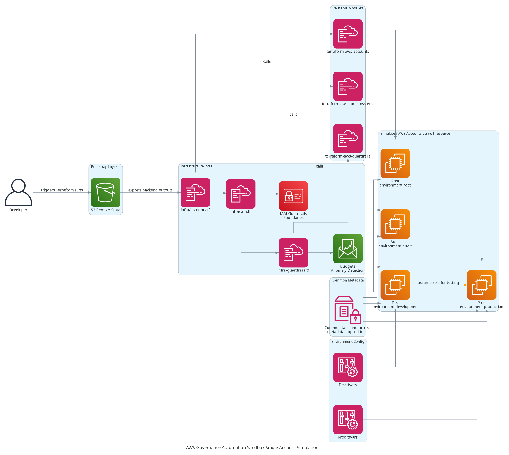

# Simulated Multi-Account AWS Organization & Governance (Single Account Version)

## Architecture Diagram


## Overview
This project simulates a multi-account AWS Organization using a single AWS account. It allows practicing organizational best practices, governance, and automation without creating multiple real AWS accounts. The simulation separates `Root`, `Dev`, and `Prod` environments using either naming conventions, Organizational Units (OUs), and IAM boundaries.

The goal is to gain hands-on experience with AWS governance, cross-environment IAM role assumption, Terraform state management, and budget enforcement in a realistic but safe environment.

## Architecture
The project uses a layered structure:

```
aws-simulated-org/
├── bootstrap/                       # Bootstrapping layer (one-time setup)
│   ├── main.tf                      # Creates backend S3 bucket
│   ├── variables.tf                 # Inputs (region, account aliases, etc.)
│   ├── outputs.tf                   # Exports backend info for infra/
│   ├── providers.tf                 # Local provider config (no remote backend yet)
│   ├── backend_override.tf          # Temporary local backend during bootstrap
│   └── terraform.tfvars.example
│
├── infra/                           # Core infrastructure (Org simulation)
│   ├── main.tf                      # Empty or high-level orchestration (optional)
│   ├── providers.tf                 # Uses remote backend (S3 from bootstrap)
│   ├── variables.tf                 # Shared input definitions
│   ├── outputs.tf                   # Shared outputs (if needed)
│   ├── terraform.tfvars.example
│   ├── accounts.tf                  # Calls terraform-aws-accounts module
│   ├── iam.tf                       # Calls terraform-aws-iam-cross-env module
│   ├── guardrails.tf                # Calls terraform-aws-guardrails module
│   ├── budgets.tf                   # (Optional) Cost monitoring / budgets module
│   └── env/                         # Environment-specific configs
│       ├── dev.tfvars
│       └── prod.tfvars
│
├── modules/                         # Reusable Terraform modules
│   ├── terraform-aws-accounts/      # Simulated AWS accounts (root, audit, dev, prod)
│   │   ├── main.tf
│   │   ├── variables.tf
│   │   ├── outputs.tf
│   │   └── README.md
│   ├── terraform-aws-guardrails/    # IAM deny policies, permission boundaries
│   │   ├── main.tf
│   │   ├── variables.tf
│   │   ├── outputs.tf
│   │   └── README.md
│   └── terraform-aws-iam-cross-env/ # Cross-environment IAM assume-role setup
│       ├── main.tf
│       ├── variables.tf
│       ├── outputs.tf
│       └── README.md
│
└── README.md                        # Project overview, usage, and workflow
```

Key points:
- **Bootstrap Layer:** Sets up S3 bucket for remote Terraform state with locking and initial IAM policies.
- **Infra Layer:** Simulates accounts, defines budgets and cost anomaly detection, configures IAM roles and guardrails.
- **Modules:** Reusable Terraform components for accounts, IAM cross-account roles, and guardrails.
- **Environment Workspaces:** Separate `Dev` and `Prod` workspaces to isolate state while still using a single AWS account.

## Key AWS Services
- **IAM:** Policies, permission boundaries, and cross-environment role simulation.
- **S3 + state locking:** Remote Terraform state storage with state locking.
- **AWS Budgets & Cost Anomaly Detection:** Enforce simulated billing visibility and control.

## Terraform Modules Used
- **account:** Simulates AWS account creation and OU setup.
- **guardrails:** Implements IAM deny policies and service control policies.
- **iam-cross-account:** Sets up cross-environment role assumption for Dev → Prod access.

## Pipeline Overview
1. **Bootstrap:** Run the `bootstrap/` layer to create remote backend resources and initial guardrails.
2. **Infra Deployment:** Apply the infra/ layer using environment-specific variable files (dev.tfvars or prod.tfvars).
3. **Module Usage:** Terraform modules manage accounts, guardrails, and IAM roles consistently.
4. **Remote State:** All Terraform states are stored in S3 with state locking to simulate team usage.

## Lessons Learned
- Setting up the **bootstrap layer** helped me understand how to create a reliable Terraform remote state using S3 with state locking.
- Configuring initial **guardrails** at the org root level clarified how IAM policies and permission boundaries can control future deployments.
- Even in a single-account simulation, carefully planning the structure of workspaces (`Dev` vs `Prod`) is important to avoid state conflicts.
- Preparing the tagging strategy early makes it easier to enforce governance once infra resources start being created.

## Future Improvements
- Expand simulation to real multi-account AWS Organizations.
- Implement CI/CD pipelines for automated Terraform runs.
- Add detailed architecture diagrams for each environment.
- Include automated policy compliance checks and reporting.
